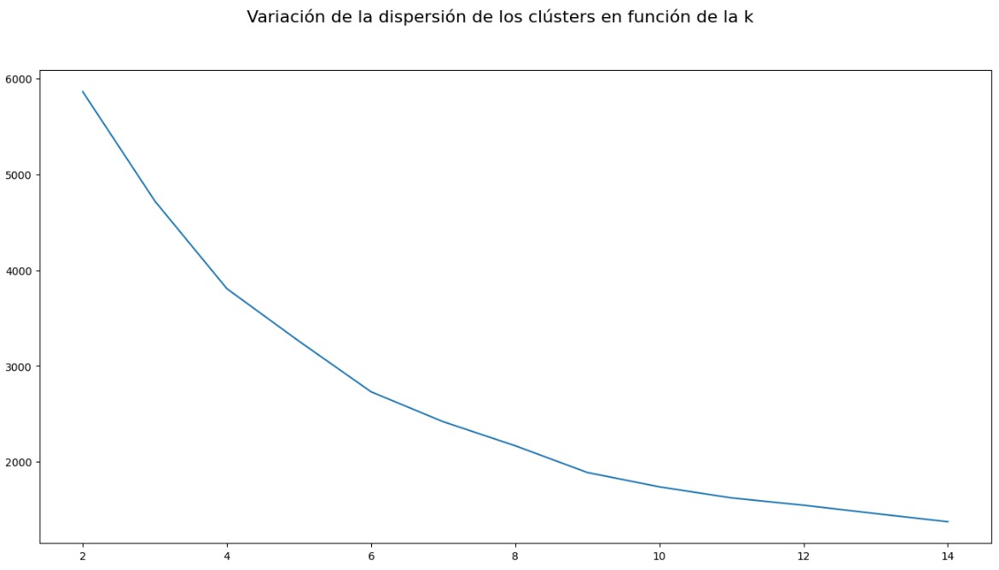
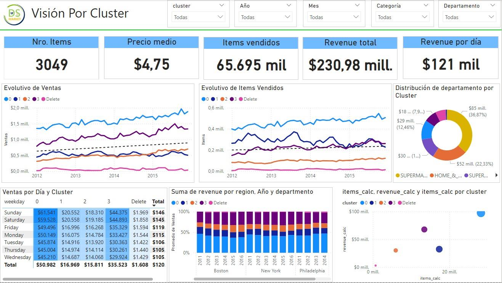
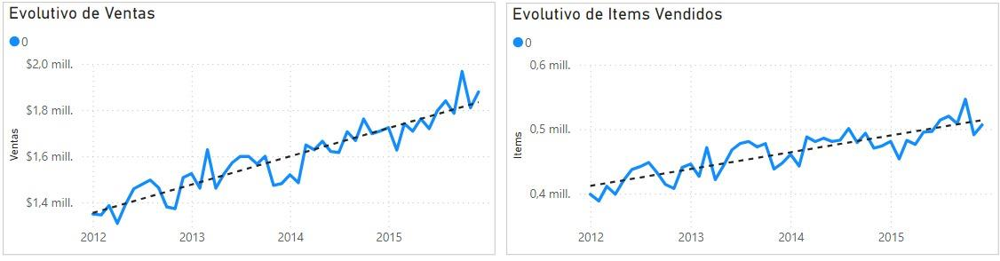
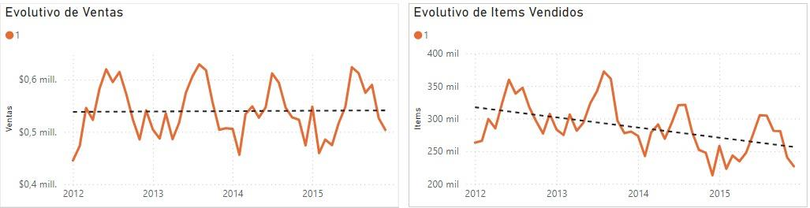
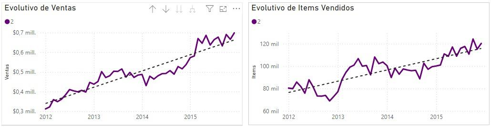
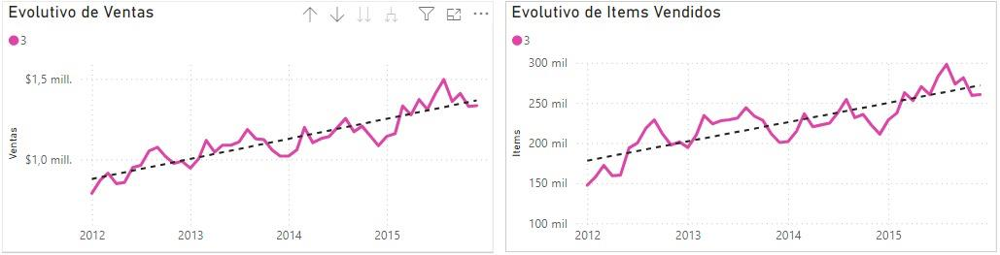
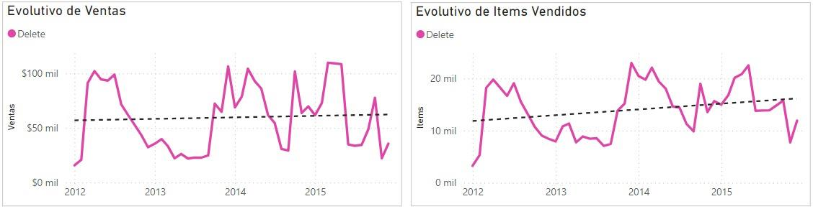

# Clustering
**Here you have the notebook with the code used for this section: [Clustering](Notebooks/2_Clustering.ipynb)**

After conducting the business analysis, we will try to identify groups of products that behave similarly to more effectively focus our Marketing campaigns according to our clusters.

To do this, we will cluster by item instead of by ID, as the items show quite similar behavior across stores. We refined the database to retain the most relevant information for each item by creating new variables, such as the minimum, maximum, mean, and median of price, sales, and revenue. Similarly, these measures were also created specifically for weekends and for dates coinciding with special events.

After several iterations and tests, we ran the KMeans model to estimate up to 14 clusters, resulting in the following variation in dispersion.

    

After initially analyzing the results for 8 clusters, we observed that the best estimate was achieved with 4 clusters. When visually representing the behavior of price and sales, we identified groups corresponding closely to the behavior of the 4 clusters.

Thus, we created a list of items for each cluster and proceeded to analyze the segmentation in PowerBI.

We added an extra column within the clusters to flag an issue mentioned by the company, which corresponds to products with low sales. This column is labeled as 'Delete' and includes those items that we mentioned earlier for removal. Comparison of KPIs for each cluster:

|  |  Cluster 0   | Cluster 1   | Cluster 2   | Cluster 3  | Delete  |
|----------|------------|------------|------------|------------|------------|
| Nº Items | 1346 | 84 | 561 | 1033 | 25 |
| Mean Price | 3,78 $ | 1,89 $ | 7,4 $ | 6,81 $ | 4,49 $ |
| Items Sales | 28,25 M | 17,34 M | 5,97 M | 13,44 M | 0,7 M |
| Total Revenue | 97,53 M$ | 32,5 M$ | 30,2 M$ | 67,8 M$ | 3 M$ |
| Revenue per Day | 51 K$ | 17 K$ | 16 K$ | 36 K$ | 1,61 K$ |

    

## Cluster 0
Cluster 0 is composed of a large number of items (44.5%), with an average price similar to the mean and a growing trend compared to previous years. There is a 20% increase in weekend sales. All items in this cluster belong to the Supermarket category. This cluster accounts for nearly half of the total revenue.

    

## CLuster 1
Cluster 1, in contrast, is composed of 84 items (2.7%) distributed across departments in all categories. It has an average price well below the mean and highly seasonal sales, with virtually no growth over the years. While it follows the trend of higher weekend sales, its main characteristic is high demand in the summer months. Notably, it shows a declining sales trend, which does not impact revenue due to price increases, but between 2010 and 2015, sales volume dropped by approximately 15%.

    

## Cluster 2
Cluster 2 is also composed of a limited number of items (18.5%), with an average price well above the mean. These items belong exclusively to the Accessories category, with the Accessories 1 department accounting for 95% of the items. Sales and units sold have increased steadily since 2012, and in 2015, sales doubled compared to 2012.

    

## CLuster 3
Cluster 3, lastly, also consists of a large group of items (34%), but exclusively from the Home & Garden category. These items have an average price above the mean with a growing trend compared to previous years. In fact, despite selling 25% less than Cluster 1, it generates twice the profit of that cluster.

    

## Items deleted
These items have shown a clear decline in sales over recent weeks. They are characterized by accounting for less than 2% of profits over all these years and having sold only 0.7 million units.

    

