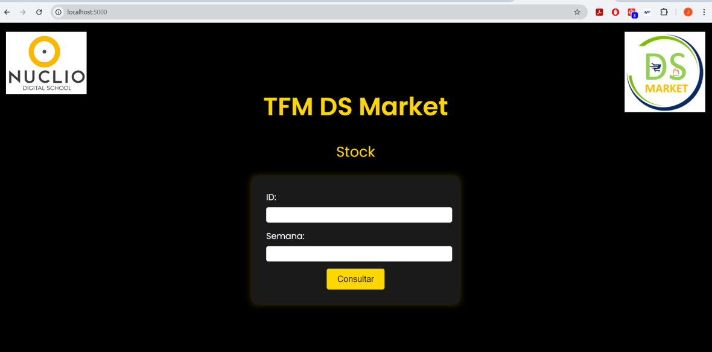
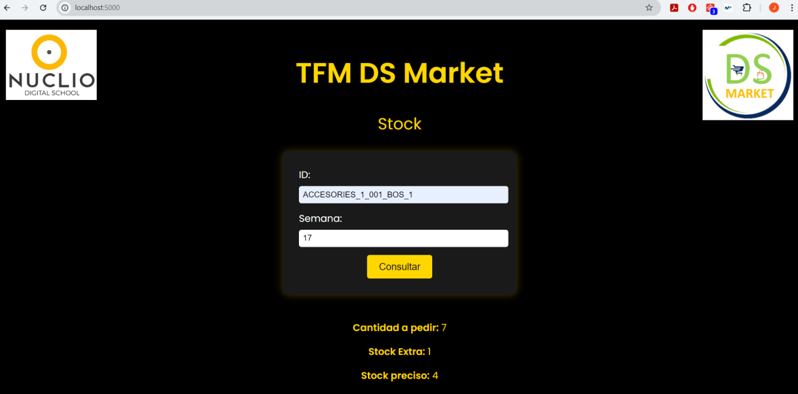
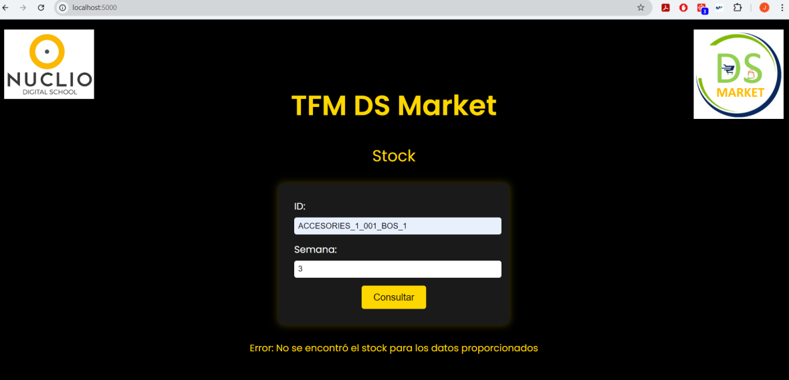

# Store Supply and API
To carry out store replenishment, we will use the forecasts created with our time series model combined with an EOQ (Economic Order Quantity) model. This approach aims to achieve the best stock adjustment for each product in each store, i.e., for each ID. In the project notebook, all the coding details can be seen. For our stock, we will create the dataframe 'df_stock.'

The EOQ model is a widely used tool for inventory control and store replenishment. This model allows us to optimize both the order size and the safety stock that we should maintain in each of our stores based on each ID. In fact, this model is very useful for handling products with high variability in sales, ranging from items that sell infrequently to those sold regularly.

To apply the formulas on which this model is based, we need certain variables, which include:

- Calculation of average sales (D): in our case, this will be the value of the 'df_stock['n_sales']' column, which contains the values provided by our time series model.
- Standard deviation of product demand (σ): a new column created afterward showing this deviation, 'df_stock['std_deviation']'.
- Cost of placing an order (S): a column expressing the cost of placing an order for each product. In our case, we chose 10% of the 'sell_price,' although the logistics team could provide a more precise estimate. This variable will be 'df_stock['sell_price'] * 0.10'.
- Cost of holding a product (H): this variable represents the cost to the company of holding a product in stock; we chose 5%. Like the S variable, logistics could adjust this value. This variable corresponds to 'df_stock['sell_price'] * 0.05'.

Once we have these variables, the model will provide three values to supply our stores using the formulas detailed in the notebook. These are:

1. Economic Order Quantity (EOQ): the number of units that should be ordered per request.
2. Safety Stock (SS): this provides the inventory buffer quantity to mitigate demand deviations. This means extra stock to handle potential changes in demand or supply issues from vendors.
3. Reorder Point (ROP): represents the inventory level at which a new order should be placed to restock before depletion. This value will indicate when it is necessary to replenish the product and will thus be considered the minimum required stock.

It should be noted that this replenishment model can be adjusted based on the products in stock; for instance, formulas could be adjusted for more perishable items or those with very high demand. Additionally, products with a minimum stock level of 0 can be sold on-demand to customers.

Finally, our final stock dataframe is structured as follows.

| | id   | week | n_sales | n_sold_products | stock_extra | stock_required |
|-------------|------------|------------|------------|------------|------------|------------|
|0| ACCESORIES_1_00 1_BOS_1  | 17  | 3  | 7  | 1  | 4  |
|1| ACCESORIES_1_00 1_BOS_2  | 17  | 4  | 8  | 1  | 5 |
|2| ACCESORIES_1_00 1_BOS_3  | 17  | 4  | 8 | 1  | 5  |
|3| ACCESORIES_1_00 1_NYC_1  | 17  | 7  | 10  | 2 | 8  |
|4| ACCESORIES_1_00 1_NYC_2  | 17  | 7  | 10  | 2  | 8  |

## API development
With all the previous work, our goal will be to optimize the stock replenishment process by developing an API, enabling the model to be accessible and usable for consulting the necessary stock levels.

In our use case, the primary function of the API is to provide precomputed information on the required stock for a specific product at a particular store and for a specified week. This information is essential for optimizing inventory replenishment in stores, minimizing excess stock and ensuring that products are available for customers without overstocking.

Thus, this API will be simple and will receive a request with the following parameters:

- Id: The unique identifier key for the item in question at a specific store.
- Week: The week number for which the necessary stock information is needed.
  
Upon receiving the request, the API will search for the corresponding entry in the previously mentioned df_stock dataframe, which contains the precomputed information.

Finally, the API will return the stock information in JSON format, allowing the user making the request to utilize this data for inventory replenishment decisions and to make this process more efficient.

At this stage, the API can return two types of responses, depending on whether the stock dataframe contains the necessary information for the selected id and week. If there is a record in the stock dataframe for a product at a specific store and for a given week, the API will return the corresponding stock values, i.e., the row in df_stock that contains the query values. Conversely, if the pair of query values (id and week) does not have a matching record in the stock dataframe, the API will return an error message indicating that no data was found for the specified id and week.

Below are some examples of the home screen and the queries that the API allows.

    

    

    

For deploying this API, we used Flask, a Python framework that facilitates the creation of web applications, and Docker, which packages the application into a container that can then be easily deployed on any server supporting Docker, thus eliminating the need to manually configure each target server. All of this was set up while working in a VS Code environment.
