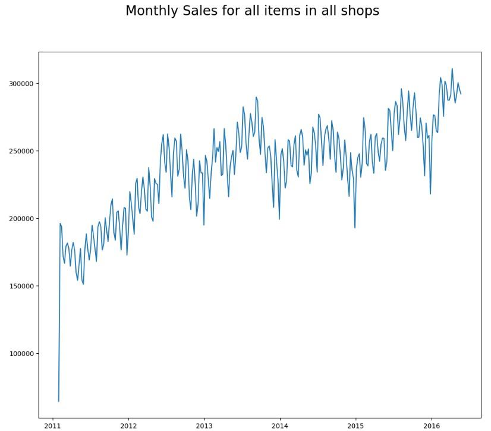
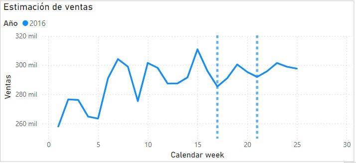

# Time Series
For the Time Series model, several options were considered. Models like ARIMA and PROPHET were trained, but we ultimately determined that the best option for a multivariate dataframe was to make the prediction with an XGBOOST model.

This XGBOOST model was also trained in different ways. Initially, we opted for daily training, but we observed that it was much slower and required a large amount of RAM and memory, and the predictions were less accurate on a weekly basis.

Finally, we decided to train the model with weekly sales data to achieve more realistic predictions. For this, we retained the sell price of the last week for each ID.

Here is the sales evolution, including a 4-week forecast.

    

Our time series model provides 4-week forecasts, but by repeating this process three times, we were able to extend our predictions to 12 weeks and graph the results. However, the main focus is on the first 4 weeks, as this is the part of the model that is trained with fully real data. Ideally, we would iterate our model each time we have new real data, rather than using data that matches our model's previous predictions.

    

    

Looking at this more detailed global graph for 2016, we can observe our first 4 weeks of predictions, which are marked in the designated area on the graph. They are characterized by an increase in sales compared to our starting point, which is week 17. This rise is around 5.5% during the first two weeks, then decreases by 1.5% over the following two weeks.

Thus, we can conclude that at the end of our 4-week predictions, there is an approximate 3% increase in total revenue. In the subsequent weeks, we also anticipate exponential growth, which aligns with trends from previous years, as summer is the season with expected peak sales.

Regarding global predictions by category, we find that the Supermarket category continues to contribute the most revenue, with a 6% increase at two weeks relative to week 17, but only a 2% increase by the end of the 4 weeks. On the other hand, the category showing the highest growth is Accessories, with an increase of around 7% in the second week, reaching up to 7.5% by the end of the 4-week forecast period compared to week 17.

## Sales forecast in Boston
Regarding our forecasts for the Boston region, we see that during the first 2 weeks, total revenue increases by 8.5% and items sold by 9.5%, decreasing to only a 5.5% increase in week 21 compared to week 17. This sales increase is driven by nearly a 10% rise in the number of items in the Home & Garden category and a 9% increase in revenue in the Supermarket category. Additionally, a key insight is an 18% increase in Supermarket 2 department sales, which could be highly valuable for marketing campaigns targeting these products at this time.

As for the stores, Roxbury (BOS_2) stands out as the store finishing the 4 weeks with the highest increase in both sales, at 6.8%, and revenue, at 7.34%.

Images

## Sales forecast in New York
In the New York region, the sales increase is expected to be the lowest, with only a nearly 2% rise in the first two weeks, reducing to about 1% by the end of the 4-week period. Notably, the only category expected to see a significant increase in sales is Accessories, with nearly an 8% growth in revenue.

Brooklyn (NYC_4) is the store anticipated to have the best sales performance during these weeks, though not exceeding 2%. However, looking towards summer, our longer-term forecasts indicate a clear upward trend for this store.

Images

## Sales forecast in Philadelphia
Philadelphia is the region expected to see the highest sales increase compared to week 17, with nearly a 10% rise in revenue. This is driven by a 14% increase in revenue in the Accessories category, marking the largest growth of any category in any region over these 4 weeks. Additionally, there is a 10% increase in Supermarket, mainly fueled by an exponential 28% growth in the Supermarket 2 department, which, as in Boston, represents the highest growth within a department. Thus, focusing the marketing campaigns we mentioned earlier on these products would be beneficial.

Among the standout stores, Yorktown (PHI_2) shows a 24% increase in revenue and nearly a 9.5% rise in items sold. Queen Village (PHI_3) also performs well, with a 20.5% revenue increase and almost a 13% increase in items sold.

Images.
